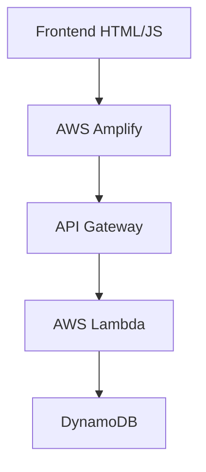

# 🔢 To the Power of Math – Serverless Calculator

A fully serverless web application built using **AWS Amplify**, **API Gateway**, **AWS Lambda**, and **DynamoDB**. The app calculates the power of a number (e.g., 2⁵ = 32), stores results in DynamoDB, and demonstrates real-time serverless computation with persistent storage and CI/CD using AWS Amplify.

## 🚀 Live Demo

👉 [Try the App Here](https://master.d2ty8p248jwx1e.amplifyapp.com/)

## 📐 Architecture Overview



## 🧠 Features

- 🧮 Calculates `base^exponent` via a RESTful API
- ☁️ Serverless architecture with AWS Amplify hosting
- 🧠 Python-based Lambda functions for computation
- 🗃️ DynamoDB for persistent storage
- 🔧 Infrastructure as Code using CloudFormation
- 🔐 Enterprise-grade security with API key authentication

## 🛠️ Technology Stack

| Component     | Technology Stack     |
|---------------|---------------------|
| Frontend      | HTML5, CSS3, JavaScript |
| Hosting       | AWS Amplify |
| API Layer     | API Gateway with REST endpoints |
| Compute       | AWS Lambda (Python 3.12) |
| Database      | Amazon DynamoDB |
| IaC           | AWS CloudFormation |
| CI/CD         | GitHub Actions + AWS Amplify |
| Security      | IAM Roles, API Keys |

## 📄 Implementation Details

### API Contract

```json
// POST /calculate
Request:
{
    "base": 2,
    "exponent": 5
}

Response:
{
    "result": 32.0,
    "timestamp": "2024-01-20T10:30:00Z",
    "requestId": "abc123"
}
```

### Security Implementation

1. **API Authentication**
   - API Key validation via `x-api-key` header
   - Usage plans with rate limiting
   - JWT validation for protected endpoints

2. **Infrastructure Security**
   - Least privilege IAM roles
   - VPC endpoints for enhanced security
   - CloudWatch logs encryption

3. **CORS Configuration**

```json
{
    "Access-Control-Allow-Headers": "Content-Type,X-Amz-Date,Authorization,X-Api-Key",
    "Access-Control-Allow-Methods": "OPTIONS,POST",
    "Access-Control-Allow-Origin": "*"
}
```

## 🔄 Data Flow

1. User submits calculation request via web interface
2. API Gateway validates API key and forwards request
3. Lambda function processes calculation
4. Result stored in DynamoDB and returned to user
5. Frontend displays result with error handling
